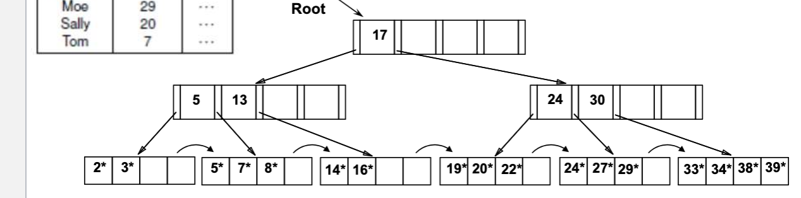
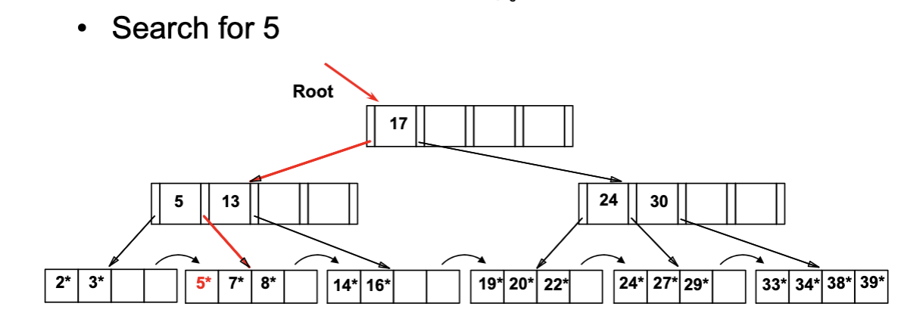
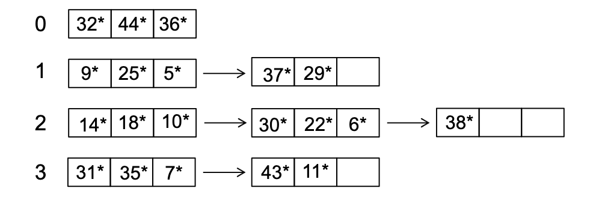
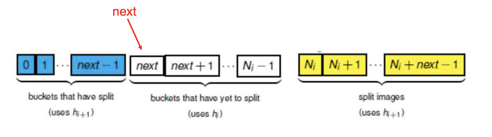
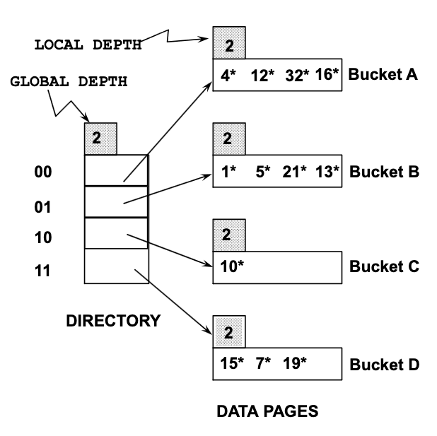
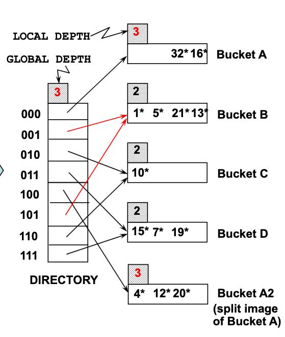

# database indexes  

### motivation 

When we retrieve records from a relation, we commonly either use single-point queries (retrieve records that match a specific value) or range queries (retrieve records whose values fall within a range). 

If the data is not organised **according to a search key**, then the DBMS may need to scan the entire file and check every record. This results in a full file scan, and can require many expensive disk page accesses. This motivates the use of a data structure to speed up retrievals based on **some search key**

### what are indexes 

An index is a data structure associated with a relation that provides a faster access path for retrieving records based on some search key. 

##### search keys 

Any subset of the fields of a relation can be a search key for an index on the relation. It is important to note that search key is not the same as a key on a relation 
> Recall that: superkey = uniquely identifies records, key/candidate key = minimal superkey, primary key = chosen candidate key

For EACH search key, we can build an index, implying that there can be multiple indexes on a single relation, providing different access paths. 

If the indexed search-key values are guaranteed to be unique (i.e if search key is a superkey), then it is a  **unique index**. Otherwise, it is a **non-unique** index. 

##### clustered vs unclustered indexes 

A **clustered index** is an index whose search-key ordering matches the physical ordering of the data records/pages stored on disk.

Creating a clustered index may require reorganising the data file according to the search key. Because a file can only have one physical ordering, a relation can have at most one clustered index. Clustered indexes are especially good for range queries: once you find the first qualifying record, the following qualifying records tend to be physically nearby on disk.

##### dense vs sparse indexes 

A **dense index** contains an index entry for every search-key value that appears in the data file. This makes lookups straightforward, since the desired search-key value can be found directly in the index.

A **sparse index** contains entries for only some search-key values, typically one entry per data page. To find a key, the DBMS finds the nearest preceding index entry, follows its pointer to the data file, then scans forward until it finds or passes it. Because this only works if the data file itself is ordered by the search key, **every sparse index must be clustered**.

Sparse indexes are smaller and cheaper to maintain than dense indexes, but they may require scanning within the data file after using the index

##### logical view of an index 

From a high level, the index data structure can be thought of as a sorted colection of `(search-key value, pointer to data on disk)`. Because the entries are ordered by the search-key, the DBMS can search the index efficiently and then follow the pointer to the corresponding data. If an index file gets too large, and the index is ordered (ordered indexes), we can build an index over the index, producing a multi-level index. 

With this, we can take a look at two main ways of organising index entries, and their benefits. As we implemented indexes, we usually have to consider things like search performance, storage overhead and update performance for when new entries are added. 
>note: if we do not expect much changes to a table, then update performance as metric would not matter as much anymore

### tree-structured indexing 

Tree-structured indexing techniques usually support both range searches and equality searches. 

#### implementation using a b+ tree

##### leaf nodes

In b+ tree indexes, the LEAF nodes of the tree store **sorted data entries** in the form k* where 

`k* denotes an entry of the form (k, RID)`

where k = search key value of the corresponding data record and RID is the RID of the corresponding data record. An RID typically looks like (pageid, slotid) so that is how the DBMS knows eventually where to look for that record. 
> The DBMS is already aware of the pages that belong to this file. So with page id, and the slot id within that page, it would be able to find the record in that page that it is looking for

The leaf nodes are either singly or doubly linked, making it efficient for range search



##### internal nodes (non-leaf nodes) 

An internal node has the form:

```text
(p0, k1, p1, k2, p2, ..., kn, pn)
```

where:

- `p_i` is a pointer to a child subtree
- `k_i` is a separator value used to decide which pointer to follow

Essentially this means that we follow `p0` for keys `< k1`, follow `p1` for keys `k1 ≤ key < k2`, follow `p2` for keys `≥ k2`

>key values for internal nodes are separators and do not necessarily need to correspond to any key values 
##### order and node structure 

`Each node, be it a leaf node or an intermediate node, corresponds to a page.`

This means that each node access costs an I/O operation. 

Additionally each B+ tree index has a property called an **order**, which refers to the number of entries that each node can hold. An order m, means that the node can hold d = m x 2 entries. This node size and order is designed around the page size for simplicity, hence once we know the page size, we can determine our order

> We then have 2d keys and 2d+1 pointers for a node and the total space taken up by these should be the page size or just under the page size

> Leaf nodes have 2d+2 pointers if it is a doubly linked since it needs a pointer at the start/end of the node. 2d+1 for singly linked since it only needs one "next" pointer at the end


##### properties of a B+ tree index

- **Height-balanced** — all leaf nodes are at the same depth, so search, insertion and deletion are efficient, typically $O(\log_f n)$, where \(f\) is the fanout and \(n\) is the number of leaf pages. 
>math => each level we multiply by f nodes until we reach the total number of n leaf nodes so total is $O(\log_f n)$

- **Grows and shrinks dynamically** — nodes can split or merge as records are inserted or deleted.
- **At least 50% occupied** (except the root) — for a tree of order \(m\), each leaf contains between \(m\) and \(2m\) data entries. This keeps the tree space-efficient.
- **Sorted leaf entries** — data entries in the leaf nodes are ordered by search key.
- **Leaf nodes are linked** — each leaf has a pointer to the next leaf, allowing efficient sequential and range scans.

##### searching in a B+ tree

A search begins at the **root** and follows pointers down the tree until the appropriate leaf node is reached.

At an internal node, compare the search key \(k\) with the separator keys:

- find the largest separator \(k_j\) such that k >= kj
- follow pointer \(p_j\)
- if no such separator exists, follow the leftmost pointer \(p_0\)

This process continues until a leaf node is reached, where the required data entry can be found.



For a **range query**, first search for the lower bound of the range. Since leaf entries are sorted and the leaves are linked together, we can then scan through consecutive leaf nodes until the upper bound is reached.

##### formats of data entries

The entries stored at the leaf level can take several forms.

**Format 1**

`k* = actual data record`

The leaf node stores the entire record itself.

**Format 2** (default)

`k* = (k, rid)`

The leaf stores the search-key value `k` together with a **record identifier (`rid`)** pointing to the corresponding data record.

**Format 3**

`k* = (k, rid-list)`

The leaf stores the search-key value `k` together with a list of record identifiers for all records having that search-key value. This is useful for **non-unique search keys**, where multiple records may share the same value.

#### inserting into a B+ tree

The insertion algorithm is:

- Find the correct leaf node \(L\).
- Insert the new data entry into \(L\).
- If \(L\) still has enough space, insertion is complete.
- Otherwise, **split** \(L\):
  - Create a new leaf node \(L_2\).
  - Redistribute the entries roughly evenly between \(L\) and \(L_2\).
  - **Copy up** the first key of \(L_2\) into the parent, together with a pointer to \(L_2\).
- If the parent overflows, recursively split the parent:
  - Redistribute its entries between two internal nodes.
  - **Push up** the middle separator key into the parent above.
- If the root splits, create a new root. This increases the **height** of the tree by 1.

A split at any non-root level increases the number of nodes at that level and may therefore increase the **fan-out of the parent**. Only a root split increases the tree height.

##### why leaf splits copy up, but internal-node splits push up

In a **leaf split**, the separator key is **copied up** because all actual data entries must remain in the leaves.


#### deleting from a B+ tree

The deletion algorithm is:

- Starting from the root, find the leaf node \(L\) containing the entry.
- Remove the entry from \(L\).
- If \(L\) still satisfies the minimum occupancy requirement, deletion is complete.
- If \(L\) becomes underfull:
  - First try to **redistribute / borrow** an entry from a sibling that has the **same parent**.
  - Update the separator key in the parent if necessary.
- If redistribution is not possible, **merge** \(L\) with a sibling.
  - After merging, one node disappears.
  - Remove the corresponding separator key and child pointer from the parent.
- This may cause the parent itself to become underfull, so redistribution or merging may propagate recursively upward.
- If the root is left with only one child after a merge, that child becomes the new root, reducing the **height** of the tree by 1.

`UNDERFULL => For a B+ tree of order \(m\), a non-root leaf typically needs at least \(m\) entries. If deletion causes it to fall to \(m-1\), it must either borrow from a sibling or merge.`


### hash based indexing 

#### what are hash-based indexes 

Data entries are stored in buckets.

`key k => h(k) => bucket`

This is ideally best for equality selections but performance degenerates for skewed data distributions where hash does not have a equally probabalistic mapping from M universe to N buckets. 

It is also typically inefficient for range searches, since adjacent keys are not guaranteed to be mapped to adjacent buckets,although this ultimately depends on the hash function used.


#### static hashing

In **static hashing**, the file is divided into `M` buckets, where `M` is fixed when the file is created.

Each bucket consists of:

- one **primary data page**
- zero or more **overflow pages** chained from the primary page

The primary pages are allocated sequentially in the file (means they are stored sequentially in disk) and are not deallocated. Each primary page stores a pointer/page ID to the first overflow page, if one exists.

A record with search key `k` is assigned to bucket `B_j` using:

```text
j = h(k) mod M 
```
where h(k) is a hash function.



##### Insertion
1. Compute the target bucket using the hash function.
2. Insert the record into the bucket's primary page if there is space.
3. If the primary page is full, place the record in an overflow page, allocating one if necessary.

##### Search
1. Compute the target bucket using the hash function.
2. Search the primary page.
3. If necessary, follow and scan the bucket's overflow pages.
So lookup is efficient when there are few overflow pages, but performance degrades as overflow chains become longer.

##### Deletion
1. Hash the search key to find the appropriate bucket.
2. Search the primary and overflow pages for the record.
3. Delete the record.
4. If an overflow page becomes empty, it can be released.
> After deletions, records from overflow pages may also be moved toward the primary page, although static hashing does not require aggressive compaction after every deletion.

##### what do the buckets actually contain 

Buckets may either contain data records themselves, or (key, pointer) pairs to the data pages on disk like a tree index. We assume the former as a default.

#### dynamic hashing : linear hashing 

Linear hashing is a dynamic scheme where the hash file grows linearly by systematic splitting of buckets.

##### splitting 

Suppose the initial file size as N buckets. B0, B1... B(N-1). We then imagine a corresponding set of virtual buckets B(N)..... B(2N-1). To split a bucket Bi, B(N+i) would be its split image. Hence after full round of splitting, the file size dubbles and the hash function would have to change 


##### redistributing entries

Assuming for a bucket i, we have created the split bucket B(N+i). 

Assume also that we have an initial allocation function to be h0(h(k)) that gives us the last m bits of a hash h(k). 

Then an entry e belongs to bucket Bi if h0(h(e.key)) = i. So we basically initially look at the last m bits of the result of the hash. After splitting, we just have to look at the last m+1 bits to decide which of the two split buckets to send the record.
> for example before split we it could be bucket 100 after split, we look at 1100 or 0100 to decide which bucket to send it to

To grow the file linearly, the buckets are split sequentially meaning Bucket Bi MUST BE split before bucket Bi+1. After each complete round of splitting, the file size will double. 
> This is extremely important to note, because this implies that the buckets MUST be split sequentially, so the one overflowing may not always be the one being split


##### modifying the hash function 

In the middle of a splitting round, some of the original n buckets have not been split yet but some have. so we need to maintain a next to know which buckets to use the new hash function that looks at the last m+1 bits and which use the original hash function that only looks at the last m bits where N = 2^m and N is the original number of buckets



##### knowing when to split a bucket 

The default criteria to split a bucket is when **some bucket** overflows. This implies a key point that the bucket that is overflowing may not be the one that is split. As mentioned before, to grow the file llinearly, the buckets must be split sequentially. This also hence implies that some split pages may not be overloaded, they just happened to be triggered to be split

Once we split, we must increment the next pointer, so that we will know what is the next bucket to be split.

##### insertion

Find a bucket by applying the hash function. If the bucket is before next pointer, it means that we look at the last M+1 bits, if it is >= next pointer then only M bits is needed.

If a bucket is full, we add overflow page and insert data entry. This triggers a split at wherever next pointer is, so we split that bucket and also increment next. We reset next to 0 once we reach a full round of splitting. 

##### deletion 

We locate the bucket using the hash function and delete the entry.

If the LAST bucket (meaning the latest one that got split) is empty, then we can remove it, and decrement the next pointer accordingly.

##### performance 

One disk I/O unless the bucket has overflow pages. in the worst case IO cost is linear in the number of data entries, because they might all just end up in the same bucket

Poor space utilisation with skewed data distribution

#### dynamic hashing: extendible hashing 

In the case of extendible hashing, we use a directory of pointers to buckets. For a directory of size 4, we look at the last two bits of the hash value. 00 goes to bucket 0, 01 to bucket 1, and so on. 

##### local depth and global depth

- the directory has a **global depth** which tells the max # of bits needed to tell which bucket an entry belongs to
- each bucket has a **local depth** which tells the # of bits used to determine if an entry belongs to that bucket 

The distinction between the two will become clearer as we discuss splitting. This also implies that the directory should only have as many entries as 2^(global depth) and global depth is essentially the max local depth.




##### insertion

As seen above, each directory entry maps to a data page. 

If local depth == global depth, then when we have to split a bucket, we need to double the directory entries so that we have more directory entries. But ths does not mean we have to double ALL the buckets together with it, we can just point multiple directory entries to the same bucket for those that do not need doubling as seen in the diagram  below




##### performance 

If the directory already exists in RAM, then we would need only one I/O disk operation to load the bucket. Else, we would need two, one for the directory and one for the bucket. 

directory grows in spurts, and if the distribution of hash values is skewed then the directory can grow large

##### deletion

If the removal of a data entry makes a bucket empty, then it can be merged with its split image, and we can update it's directory entry. 

If each directory element then points to the same bucekts as its split image (i.e, we can halve the directory.


