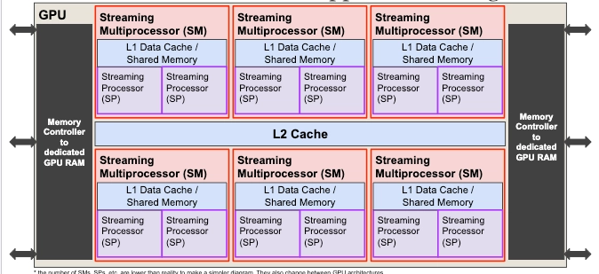
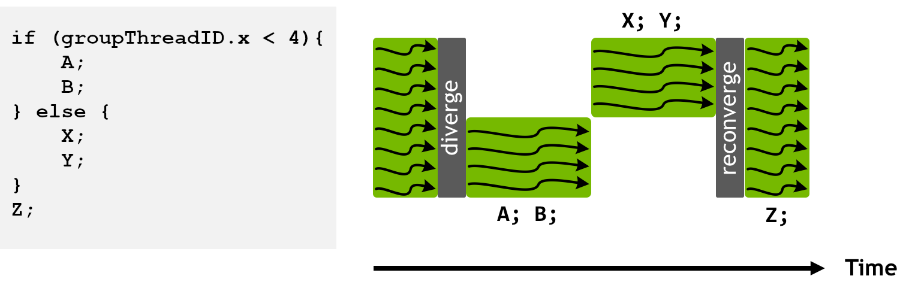

## <mark>GPU Programming</mark>

#### <mark>motivation</mark>

Problems with a small sequential fraction can benefit significantly from parallelism. From Amdahl's Law,

$$
S(N) = \frac{1}{f + \frac{1-f}{N}}
$$

where f is the fraction of the program that cannot be parallelised and N is the number of processors.

For example, if (f = 0.05), the theoretical maximum speedup (as N tends to infinity) is:

$$
S_{\max} = \frac{1}{0.05} = 20
$$

Reaching close to this limit requires a very large number of processors. 
One option is to distribute the computation across multiple machines, but this introduces additional communication and network overhead.
Alternatively, we can increase the amount of parallelism available within a single machine. CPUs, however, typically contain only a relatively small number of powerful cores. 

> CPU hierarchy recap: a machine can contain multiple CPU sockets. Each socket contains one physical CPU/processor, each processor contains multiple physical cores, and each core may support multiple hardware threads through technologies such as simultaneous multithreading (SMT).

This motivates the use of GPUs, which contain a much larger number of simpler processing units designed for **highly parallel workloads**.


#### <mark>cpu vs gpu comparison</mark>

A CPU and GPU typically exist within the same machine and communicate through a high-speed interconnect such as PCIe. We can loosely think of them as having different design goals:

A CPU is optimised primarily for **low-latency execution**. Individual CPU cores are designed to execute a single thread quickly and efficiently. Hence, they have relatively few, but powerful and complex cores


A GPU is instead optimised for **high throughput**. An individual GPU thread is generally much less capable than a CPU thread, but the GPU can execute thousands of threads concurrently


#### <mark>cuda programming model</mark>


First, it is useful to understand the programming model exposed by CUDA, before appreciating how it is mapped onto the underlying hardware architecture.

A CUDA kernel is a "specialized function designed to run on a GPU". When we launch a CUDA kernel we describe the computation using a hierarchy of **threads, blocks, and grids**, and the GPU maps this logical work onto the available hardware.

- A **thread** is one execution instance of a kernel. Every thread runs the same defined kernel code, typically on a different piece of data.
- A **block** is a group of threads that can cooperate. Threads within the same block can synchronise and communicate through shared memory.
- A **grid** is the collection of all blocks created by a single kernel launch.

For example:

```cpp
kernel<<<100, 256>>>(...);
```

launches a grid containing **100 blocks**, with **256 threads per block**, for a total of **25,600 threads**. Each of these threads would then execute the kernel. 

##### <mark>1D, 2D and 3D organisation</mark>

Both threads within a block and blocks within a grid can be organised in one, two, or three dimensions. This does not fundamentally change how the computation executes; it simply makes it easier for the logical layout of threads to match the shape of the data being processed.

For example, a 1D layout is natural for arrays, a 2D layout for images or matrices, and a 3D layout for volumes.

For a 1D launch, ordinary integers are sufficient:

```cpp
kernel<<<4, 256>>>(...);
```

For 2D or 3D layouts, CUDA provides the `dim3` type:

```cpp
dim3 threads_per_block(16, 16);
dim3 blocks_per_grid(4, 4);

kernel<<<blocks_per_grid, threads_per_block>>>(...);
```

Here, the grid contains `4 × 4` blocks, and each block contains `16 × 16` threads. So we can think of each thread having an (x, y) index. 

##### <mark>Identifying each thread</mark>

Because every thread executes the same kernel code, each thread needs a way to determine which piece of data it should process. CUDA provides several built-in variables for this:

- `threadIdx`: the thread's position within its block
- `blockIdx`: the block's position within the grid
- `blockDim`: the dimensions of each block
- `gridDim`: the dimensions of the grid

Each provides `.x`, `.y`, and `.z` components depending on the dimension of the layout.

Importantly, `threadIdx` is only unique **within a block**. For example, thread 0 in block 0 and thread 0 in block 1 (assuming 1D layout) both have:

```cpp
threadIdx.x == 0
```

To obtain an index that is unique across the entire grid, we combine the block's position with the thread's position inside that block:

```cpp
__global__ void add(float *a, float *b, float *c, int n) {
    int i = blockIdx.x * blockDim.x + threadIdx.x;

    if (i < n) {
        c[i] = a[i] + b[i];
    }
}
```

The expression

```cpp
blockIdx.x * blockDim.x
```

skips over all threads belonging to earlier blocks, while `threadIdx.x` gives the thread's position within the current block.

For example, with 256 threads per block, thread 3 in block 2 obtains:

```text
i = 2 × 256 + 3 = 515
```

and therefore processes element 515.

Now with an overview of the CUDA programming model, we can better appreciate how it is executed on the hardware of the GPU.

#### <mark>gpu hardware architecture</mark>



#### <mark>gpu hardware architecture - gpu ram</mark>

A discrete GPU typically has its own dedicated main memory called VRAM. The CPU and GPU therefore have separate memory spaces, and data often has to be copied between RAM and VRAM before the GPU can work on it. That transfer usually happens over the PCIe. An exception is integrated GPUs that do not have separate VRAM but instead share the computer's main RAM with the CPU
> VRAM is technically a specialized subtype of DRAM optimized for high bandwidth, so we can call it both

#### <mark>gpu architecture - streaming processor</mark>

A streaming processor (SP) is the closest equivalent to a physical core in a GPU’s architecture. It attempts to execute up to 32 threads (a warp) at the same time (clock cycle).

##### <mark>compute units within the SP</mark>

Depending on the architecture, i.e. Hopper Architecture, it may have different compute power, i.e. how many FP64, INT32 ALU units etc. These compute units exist on a **SP level**, i.e. they are shared only **within an SP, by a warp**. When the warp executes an instruction, its 32 threads are mapped onto the available ALUs for that instruction type.

If the SP has enough ALUs to service all 32 threads at once, the instruction can be completed in a single cycle. Otherwise, the warp must be processed over multiple cycles. For example, if an SP has only **16 INT32 ALUs**, then a warp executing an INT32 instruction would require two cycles to process all 32 threads. If the same SP instead had **32 FP32 ALUs**, an FP32 instruction could be serviced for all 32 threads in one cycle.

This means the throughput of different instruction types depends on how many corresponding execution units the architecture provides. On such an architecture, FP32 operations may have higher throughput than INT32 operations.

#### <mark>gpu architecture - streaming multiprocessor</mark>

A **Streaming Multiprocessor (SM)** consists of multiple Streaming Processors (SPs), together with resources used to manage and execute many threads concurrently.

##### <mark>register file</mark>

The SM contains a large register file, which is partitioned among all threads currently resident on that SM. Each thread receives its own registers from this register file.
> However, the register file is finite. High register usage per thread can reduce the number of threads, warps and blocks that can reside on the SM simultaneously.

##### <mark>L1 cache and shared memory</mark>

Each SM also contains fast on-chip L1 data cache, a portion of which can be reserved for shared memory. The L1 cache stores recently accessed data for threads running on the SM. The amount reserved for shared memory is explicitly defined by the programmer.

Because an entire block resides on one SM, all threads in that block can access that block’s shared-memory allocation. **Different blocks receive separate portions of shared memory and cannot directly access one another’s shared-memory data.**

##### <mark>block residency</mark>

When a CUDA block is scheduled for execution, the **entire block is assigned to one SM**. The block remains resident on that SM until it finishes and does not migrate to another SM. Several blocks may be resident on the same SM at the same time, **provided there are sufficient SM resources such as registers and shared memory.**


##### <mark>warp scheduling</mark>

The threads within each block are divided into groups of **32 consecutive threads called warps**. Although the block is assigned to an SM, the individual warps within that block are assigned to the SPs within that SM. Each SP can have multiple warps waiting to execute. The warp scheduler selects a ready warp assigned to that SP and allows it to execute.

Since several blocks may be resident on the same SM at once, the warps assigned to a particular SP may come from **multiple different blocks**. If one warp stalls, for example because of a global memory access, data dependency or synchronisation, another ready warp can execute instead. Because the register state of all resident warps is already stored in the SM's huge register file, switching between warps is extremely fast.

This is the basis of **latency hiding**, that allows for the high throughput of GPUs.

##### <mark>deciding how to allocate cache and shared memory</mark>

Recall that having latency hiding essentially means that we want to be able to context switch quickly whenever a warp stalls, i.e. due to global memory access, data dependency or synchronisation. This means we want multiple ready warps available for execution. If each block takes up too much shared memory, then fewer blocks can be resident on the SM, meaning fewer resident warps are available for latency hiding.

> Total shared memory consumed is additive. If each block needs 10 KB and you have 4 blocks resident on an SM, you need 40 KB of shared memory available on that SM. If you do not have enough, the number of resident blocks must be reduced until the resource requirements fit.

L1 cache hence only earns it share, when we require a lot of global accesses that do not fit in shared memory, or irregular access patterns that cannot be tiled into shared memory.  A well written tiled kernel should bias heavily toward shared memory. A kernel with unavoidable irregular global memory access should bias toward L1.

Register usage creates a similar constraint. The SM has a finite register file, so high register usage per thread can reduce the number of blocks and warps that can be resident simultaneously.

#### <mark>gpu architecture - warps and SIMT execution</mark>

As seen before, each block runs on a single SM without migration. Each block is further broken down into warps (32) that run in the SP. Warps execute in ‘SIMT’, Single Instruction Multiple thread. They execute in lock step, but as seen below divergence causes issues that stunt throughput.


When a warp encounters a branch, it splits into subsets of threads (active masks) that follow different paths. With newer architectures like VOLTA, these subsets can execute and progress independently, so threads may reach later instructions like `Z` at different times. As a result, there is no guarantee that all threads reconverge automatically, and they will only execute together again if they happen to be ready at the same instruction.


#### <mark>gpu architecture - memory</mark>

Although touched upon throughout the above sectinos, this section gives a consolidated view to the different memory available on the GPU.

##### <mark>registers</mark>
**Each thread** has access to its own registers, which are the fastest storage available on the GPU. Registers are allocated from the SM's register file when the thread becomes resident. If a thread's live data cannot be kept in registers, some values may instead be stored in local memory.

##### <mark>local memory aka thread-local memory</mark>
Local memory is **private to an individual thread**. It is typically used when per-thread data cannot fit in registers, such as due to register spilling. Although its scope is local to a thread, local memory physically resides in GPU VRAM, so accesses are relatively expensive

##### <mark>shared memory</mark>
Shared memory is fast on-chip memory shared by **all threads within the same block**.Threads in the same block can use shared memory to communicate and reuse data, while threads belonging to different blocks cannot directly access each other's shared-memory allocations. Shared memory has higher bandwidth and lower latency than local or global memory

##### <mark>global memory</mark>
Global memory is the GPU's main read/write memory and resides in GPU VRAM. It is accessible by **all threads** executing on the GPU but has much higher latency than registers or shared memory. Global-memory accesses are cached

##### <mark>cache</mark>
L1 and L2 cache. Memory accesses to VRAM may be serviced through the GPU's cache hierarchy. Each SM has access to an L1 cache, while all SMs share a larger L2 cache as seen in the diagram above.

##### <mark>constant and texture memory</mark>
CUDA also provides specialised read-only memory spaces that reside in the GPU VRAM.
- constant memory is read-only and is useful for suitable linear/read-only access patterns
- texture memory is read-only and is designed for spatial access patterns such as 2D data


#### <mark>synchronization in cuda</mark>

`_syncthreads()` -> synchronizes all threads in a block via a barrier, ensures all previous operations in the block are completed before threads move on.

`__syncwarp()` -> synchronizes threads within a single warp. All threads in the warp reach this point before any proceed. Needed post-Volta because of independent thread scheduling (see warp divergence above), where threads in a warp can now diverge and execute independently.

`cudaDeviceSynchronize()` -> CPU-side call that blocks the host thread until all previously launched kernels on the GPU have completed. Used to ensure the GPU is done before the CPU tries to read results back.
> A normal CUDA kernel launch from the CPU is generally asynchronous / non-blocking with respect to the host (CPU).


#### <mark>optimizing memory accesses</mark>

A GPU program is not just limited to the kernel execution itself. A large part of performance is dictated by memory transfer between the CPU and GPU, as well as the memory accesses within the kernel itself. Hence, in this section, we explore the ways to optimise memory transfer and accesses. 

##### <mark>minimizing host-device transfers and using streams</mark>

We have to appreciate that kernel execution is usually preceded by a memory copy from the CPU to the GPU's VRAM. Transfers between CPU memory and GPU memory are relatively expensive, so we should minimize both the amount of data transferred and the number of separate transfers. Where possible, many small transfers should be combined into fewer large transfers.

CUDA also provides asynchronous copies:

```cpp
cudaMemcpyAsync(...);
kernel<....>();
```

which allow the CPU to enqueue a transfer without waiting for it to complete immediately, and carry on to the kernel invocation. 

However, if all GPU operations are placed in the **same stream**, they still execute in order, so the transfer and kernel do not overlap.

A **CUDA stream** is an ordered sequence of GPU operations. Operations in the same stream are ordered, while operations in different streams may overlap.

```text
Single stream:
Copy A → Kernel A → Copy B → Kernel B

Multiple streams:
Stream 0: Copy A ───── Kernel A
Stream 1:      Copy B ───── Kernel B
```

Thus, `cudaMemcpyAsync()` is most useful with **multiple streams**, where a memory transfer in one stream can overlap with kernel execution in another, helping to hide transfer latency.

##### <mark>tiling with shared memory</mark>

Global memory is relatively slow, so we want to avoid repeatedly loading the same data from GPU DRAM.

**Tiling** loads a subset of data from global memory into faster shared memory, allowing threads within a block to reuse that data multiple times.

The goal is therefore to perform as few global-memory accesses as possible while maximizing reuse from shared memory.

This is especially useful for workloads such as matrix multiplication, where the same values may be reused by multiple threads.

##### <mark>coalesced global-memory access</mark>

GPU global memory is accessed in fixed-size memory transactions.

Memory accesses made by the 32 threads of a warp are combined into the minimum number of **32-byte memory transactions** required to service all requested addresses. Each request from global memory is a fixed-size block of 32 bytes, hence when a warp is accessing memory, the requests are combined into some N requests of 32 bytes each. In the ideal case, we would need (# of useful bytes / 32) requests. Anything more than that is counted as an uncoalesced access.


For example:

```text
Thread 0  → arr[0]
Thread 1  → arr[1]
Thread 2  → arr[2]
...
Thread 31 → arr[31]
```

If `arr` contains 4-byte `float`s, the warp requests:

```text
32 threads × 4 bytes = 128 useful bytes
```

Since each memory transaction transfers 32 bytes, the ideal number of transactions is:

```text
128 / 32 = 4 transactions
```

This is a **coalesced access**. If the threads instead access widely separated addresses, more 32-byte transactions may be required even though the same amount of useful data is requested.

For example:

```text
Thread 0  → arr[0]
Thread 1  → arr[8]
Thread 2  → arr[16]
...
```

This can require many more memory transactions, resulting in poor memory-bandwidth utilization.

##### <mark>bank conflicts in shared memory</mark>

Shared memory has **lower latency and higher bandwidth than global memory**, but its performance still depends on the access pattern. Shared memory is divided into **32 equally-sized memory banks**. Each bank has a bandwidth of **32 bits = 4 bytes per clock cycle**, and successive 4-byte words are assigned to successive banks.

Conceptually:

```text
Word 0  → Bank 0
Word 1  → Bank 1
Word 2  → Bank 2
...
Word 31 → Bank 31
Word 32 → Bank 0
...
```

Since a warp also contains 32 threads, the ideal case is for the 32 threads to access addresses located in different banks:

```text
Thread 0  → Bank 0
Thread 1  → Bank 1
Thread 2  → Bank 2
...
Thread 31 → Bank 31
```

These accesses can occur in parallel.

A **bank conflict** occurs when multiple threads in the same warp request different addresses that map to the same bank.

For example:

```text
Thread 0 → Bank 0
Thread 1 → Bank 0
```

Since the bank cannot service both different addresses simultaneously, the accesses must be **serialized**, reducing throughput.

The goal when using shared memory is therefore not only to reduce global-memory accesses, but also to arrange the shared-memory access pattern so that bank conflicts are minimized.

##### <mark>improving instruction throughput</mark>
We would want to minimize the use of arithmetic instructions with low throughput and instead we should trade precision for speed. Single-precision float operations provide the best performance, and integer division and modulo operations are particularly costly and hence we should replace them with bitwise operations. We would also want to minimize divergence in warps.
